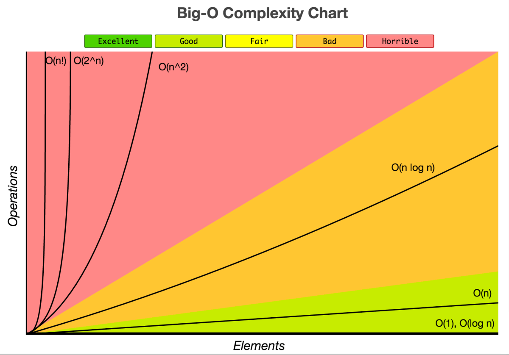

### Master the Coding Interview: Data Structures + Algorithms Series
1. **[Big O Notation](#)**

<br />

## What is good code?

1. Readable
2. Scalable [Big O Notation]

**Big-O notation** is the language we use for talking about how long an algorithm takes to run. We can compare two different algorithms or functions using big-O and say which one is better than the other when it comes to scale regardless of our computer differences.

Scaleable there's actually two things that we want to consider as engineers. One is ***speed***. Other one is ***memory***. Now time complexity is how long it takes the algorithm to run and space complicity is the memory that is required by the algorithm.




### O(n)

```js
function findNemo(array) {
  for (let i = 0; i < array.length; i++) {
    if (array[i] === 'nemo) {
      console.log('Nemo Found!');
    }
  }
}
```

### O(1)

```js
function firstBoxes(array) {
  console.log(array[0]);
}
```

### O(n^2)

```js
function pairsOfArray(array) {
  for (let i = 0; i < array.length; i++) {
    for (let j = 0; j < array.length; j++) {
      console.log(i, j);
    }
  }
}
```

<br />
<br />
<br />

Source: <br />
https://www.udemy.com/course/master-the-coding-interview-data-structures-algorithms/
