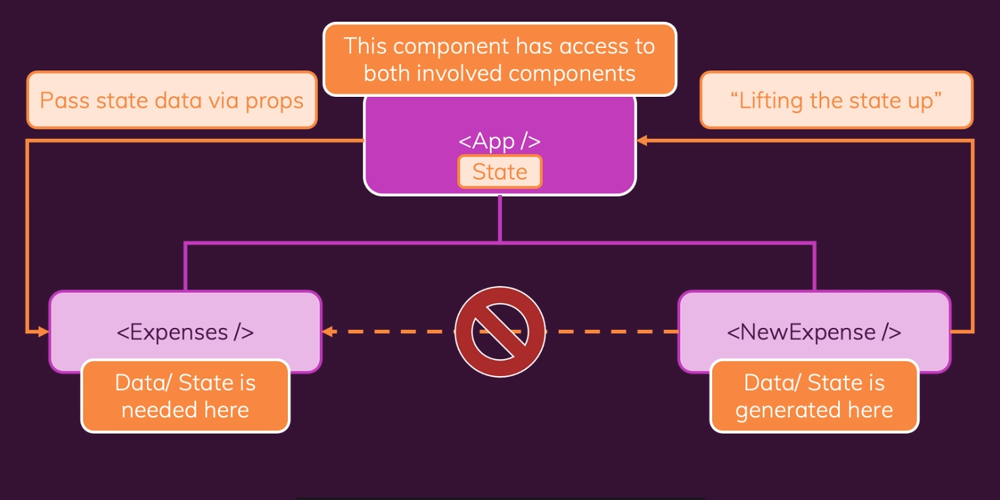

### The Complete Guide React: Hooks, React Router, Redux Series
1. **[Lets Get Started](#)**

<br />
<br />

Here's code for simple app building with react that represent all basic syntax of react.

***https://github.com/miqbalhamdani/react-complete-guide-code/tree/05-rendering-lists-conditional-content***

<br />

### 1. Listening to Events & Working with Event Handlers
components/NewExpense/NewExpense.js
```js
// line 18
const startEditingHandler = () => {
  setIsEditing(true);
};

// line 29
<button onClick={startEditingHandler}>Add New Expense</button>
```

<br />
<br />

### 2. Working "State" with React Hooks

We can set default value for `useState` inside parentheses. `useState` returns an array actually, first value is the **variable** itself, and the second element in the array is that **updating function**.

components/NewExpense/ExpenseForm.js
```js
// line 1, import useState in react hooks
import React, { useState } from 'react';

// line 6, '' is default value
const [enteredTitle, setEnteredTitle] = useState('');

// line 16, function to set state
setEnteredTitle(event.target.value);

// line 64, to display state
<input value={enteredTitle} />
```

<br />

If your state update depends on the previous state, you should use function and receive the `previous state` snapshot, and then add new state snapshot like this.
Reacts will schedules state updates, and React will guarantee it will always be the latest state snapshot.

App.js
```js
// line 37
setExpenses((prevExpenses) => {
    return [expense, ...prevExpenses];
});
```

<br />
<br />

### 3. Props
To pass data from **parent component** to **child component** we can use props.

components/Expenses/ExpensesItem.js
```js
// line 11, pass date data to ExpenseDate component
<ExpenseDate date={props.date} />
```

<br />

components/Expenses/ExpensesDate.js
```js
// line 5, add `props` key which holds all the received attributes as properties
const ExpenseDate = (props) => {
    // and we can get date data with props.date
    const month = props.date.toLocaleString('en-US', { month: 'long' });
    const day = props.date.toLocaleString('en-US', { day: '2-digit' });
    const year = props.date.getFullYear();
}
```

<br />
<br />

### 4. Communication Child-to-Parent Component (emmit)

components/NewExpense/ExpenseForm.js
```js
// line 45
const expenseData = {
    title: enteredTitle,
    amount: enteredAmount,
    date: new Date(enteredDate),
};

// pass expenseData data to onSaveExpenseData function
props.onSaveExpenseData(expenseData);
```

<br />

components/NewExpense/NewExpense.js
```js
// line 9
const saveExpenseDataHandler = (enteredExpenseData) => {
    // enteredExpenseData is payload from expenseData (ExpenseForm.js)
    const expenseData = {
        ...enteredExpenseData,
        id: Math.random().toString(),
    };
};

// line 33
<ExpenseForm
    // call saveExpenseDataHandler function, from onSaveExpenseData (ExpenseForm.js)
    onSaveExpenseData={saveExpenseDataHandler}
    onCancel={stopEditingHandler}
/>
```

<br />
<br />

### 5. Lifting The State Up

Lifting the state up it is about moving data from a child component to some parent component to either use it there or to then pass it down to some other child component.



<br />

### 6. Stateless vs Stateful Components

**Stateless Components** is the components that only focus on outputting something, like `ExpenseItem.js`, `ExpensesFilter.js`, `ExpenseDate.js
`. **Stateful Components** is the components which typically do manage state, like `Expenses.js`.

<br />

### 7. Looping

For this project, we use `jsx`, and with opening and closing single curly braces we can run basic JavaScript expressions. And also we can use it for looping.

components/Expenses/ExpensesList.js
```js
// line 13
{props.items.map((expense) => (
    // looping ExpenseItem component depends on expense data
    <ExpenseItem
        key={expense.id}
        title={expense.title}
        amount={expense.amount}
        date={expense.date}
    />
))}
```

<br />

### 8. Conditional

components/NewExpense/NewExpense.js
```js
// line 28
{!isEditing && (
    <button onClick={startEditingHandler}>Add New Expense</button>
)}

// or with ternary operator
{isMember ? '$2.00' : '$10.00'}
```

<br />
<br />
<br />

source: <br />
https://www.udemy.com/course/react-the-complete-guide-incl-redux/?couponCode=D_0621
