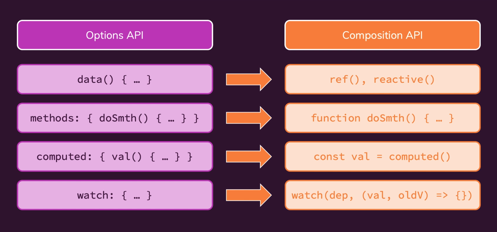
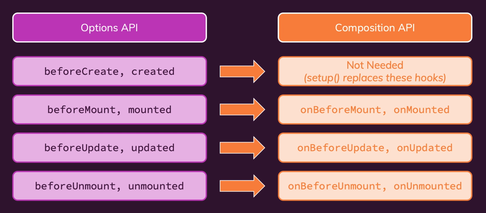

The Composition API is alternative way of writing the logic behind our components. And about the template code does not change. The Composition API is 100% optional.

You can check my `todos project` that are using nuxt and Composition API below:


## Why Composition API

When building bigger Vue apps, we might face two main limitations / issues:

1. Code that belongs together logically is split up accross multiple options (data, methods, computed).

<br />

## How to use it

In Composition API `data`, `methods`, `computed` and `watch`, going to be replaced with the new `setup` option. And about `props`, `emits`, `components`, those remain untouched by the Composition API.



Data is replaced with refs and reactive, methods are replaced with functions, Computed is replaced with the computed function, and watchers are replaced with the watcher functions.

<br />

## Composition API Setup

Because we're using nuxt, and we know that nuxt use vue 2. So we need to install Composition API dependency.

```sh
npm install @vue/composition-api
# or
yarn add @vue/composition-api
```

and import as plugins
```js
// plugins/composition-api.js
import Vue from 'vue'
import VueCompositionAPI from '@vue/composition-api'

Vue.use(VueCompositionAPI)
```

add that plugin to nuxt config
```js
// nuxt.config.js
plugins: [
  '@/plugins/composition-api',
],
```

<br />

## ref

You must import ref from Composition API.

```js
// pages/todo.vue // line 26
import { ref } from '@vue/composition-api'
```

Initial value with Option API

```js
data() {
  return {
    todos: [
      {
        name: 'Lets learn compostion API',
        isDone: false,
      },
    ],

    keyword: '',
  };
},
```

Initial value with Composition API

```js
// pages/todo.vue
setup() {
  // line 38
  const todos = ref([
    {
      name: 'Lets learn compostion API',
      isDone: false,
    }
  ]);

  // line 50
  const keyword = ref('');
}
```

<br />

Set value with Option API

```js
this.todos.push(payload);

this.keyword = payload;
```

Set value with Composition API

```js
// line 46
todos.value.push(payload);

// line 53
keyword.value = payload;
```

<br />

## reactive

Reactive is a bit like ref, but its explicitly made for objects. So you must pass an object to reactive.

```js
import { reactive } from '@vue/composition-api'

setup() {
  // initial value
  const todo = reactive({
    name: 'Learn Composition API',
    isDone: true,
  });

  // Set value
  todo.name = 'Learn Typescript';
  todo.isDone = false;
}
```

<br />

## methods

Function in Option API

```js
methods: {
  setKeyword(payload) {
    this.keyword = payload;
  },
},
```

Function in Composition API

```js
// pages/todo.vue

setup() {
  // line 52
  function setKeyword (payload) {
    keyword.value = payload;
  };
}
```

<br />

## computed

Computed in Option API

```js
computed: {
  todoList() {
    const lowerKeyword = keyword.value.toLowerCase();
    return !keyword.value
      ? todos.value
      : todos.value.filter((item) => item.name.toLowerCase().includes(lowerKeyword));
  },
},
```

Computed in Composition API

```js
import { computed } from '@vue/composition-api'

setup() {
  // line 57
  const todoList = computed(() => {
    const lowerKeyword = keyword.value.toLowerCase();
    return !keyword.value
      ? todos.value
      : todos.value.filter((item) => item.name.toLowerCase().includes(lowerKeyword));
  });
}
```

> Computed properties is read-only.

<br />

## watch

Wtach in Option API

```js
watch: {
  keyword(newValue, oldValue) {
    setTimeout(() => {
      this.$emit('search', newValue)
    }, 500)
  },
},
```

Wtach in Composition API

```js
// components/todos/FilterTodo.vue
import { watch } from '@vue/composition-api'

setup() {
  // line 24
  watch(keyword, (newValue, oldValue) => {
    setTimeout(() => {
      context.emit('search', newValue)
    }, 500)
  });
}
```

Watch in Composition API gain more flexibility, by passing an array of dependencies.

```js
import { watch } from '@vue/composition-api'

setup() {
  watch([name, isDone], (newValue, oldValue) => {
    console.log(newValue[0]);
    console.log(newValue[1]);
  });
}
```

<br />

## props

We can't use `this` in `setup()` method, because setup basically gets called too early by Vue. At this point of time, the Vue instance object, doesn't exist yet.

Setup actually is a method that accepts two arguments. The first parameter is the props parameter. The Second parameter is the context object.

Props in Option API

```js
computed: {
  isDoneBadge() {
    return this.todo.isDone
      ? '<span class="badge rounded-pill bg-success">done</span>'
      : '<span class="badge rounded-pill bg-warning">todo</span>'
  },
},
```

Props in Composition API

```js
// components/todos/TodoItem.vue

setup(props) {
  // line 24
  const isDoneBadge = computed(() => {
    return props.todo.isDone
      ? '<span class="badge rounded-pill bg-success">done</span>'
      : '<span class="badge rounded-pill bg-warning">todo</span>';
  });

  return { isDoneBadge };
},
```

<br />

## emit

The Second parameter of setup method is the context object.

Emit in Option API

```js
watch: {
  keyword(newValue, oldValue) {
    setTimeout(() => {
      this.$emit('search', newValue)
    }, 500)
  },
},
```

Emit in Composition API

```js
// components/todos/FilterTodo.vue

setup(props, context) {
  watch(keyword, (newValue, oldValue) => {
    setTimeout(() => {
      // line 26
      context.emit('search', newValue)
    }, 500)
  });
},
```

<br />

## Other Lifecycle

How about the others lifecycle, like `beforeCreate`, `created`, `beforeMount`, `mounted`, `beforeUpdate`, `updated`, `beforeUnmount`, `unmounted`.



For beforeCreate and created there actually is no equivalent, because these hooks are not needed, because the setup method basically runs at the same time beforeCreate and created ran in the past.So setup replaces these hooks.

```js
import {
  onBeforeMount,
  onMounted,
  onBeforeUpdate,
  onUpdated,
  onBeforeUnmount,
  onUnmounted,
} from '@vue/composition-api'

setup() {
  onBeforeMount(function() {
    console.log('onBeforeMount');
  });

  onMounted(function() {
    console.log('onMounted');
  });

  onBeforeUpdate(function() {
    console.log('onBeforeUpdate');
  });

  onUpdated(function() {
    console.log('onUpdated');
  });

  onBeforeUnmount(function() {
    console.log('onBeforeUnmount');
  });

  onUnmounted(function() {
    console.log('onUnmounted');
  });
}
```

<br />
<br />

You also can use **Option API** alongside with **Compostion API**, like `components/todos/AddTodo.vue`.

<br />
<br />
<br />
<br />

source: <br />
https://www.udemy.com/course/vuejs-2-the-complete-guide/learn/lecture/21527252
