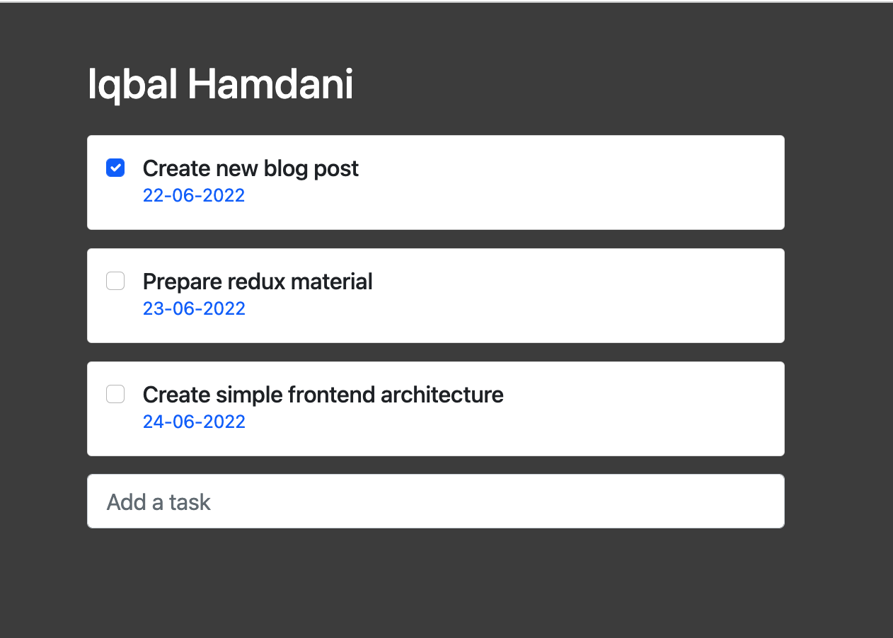

Kita akan membuat aplikasi seperti di bawah ini:



<br />

## Setup React App

Pertama kita akan melakukan setup project menggunakan React CLI dan meng-install beberapa dependency seperti react-boostrap dan firebase.

```bash
# create react app
$ npx create-react-app react-firebase-todos

# enter react app directory
$ cd react-firebase-todos

# install some dependency
$ npm install react-bootstrap bootstrap firebase
```

## Create Todo List Template with React Boostrap

src/App.js

```js
import { useState } from "react";

import "bootstrap/dist/css/bootstrap.min.css";
import "./App.css";

import Container from "react-bootstrap/Container";
import Row from "react-bootstrap/Row";
import Col from "react-bootstrap/Col";
import Form from "react-bootstrap/Form";

import CardTodo from "./components/CardTodo";

function App() {
  const [todos, setTodos] = useState([
    {
      name: "Create new blog post",
      isDone: true,
      dueDate: "22-06-2022",
    },
    {
      name: "Prepare redux material",
      isDone: false,
      dueDate: "23-06-2022",
    },
    {
      name: "Create simple frontend architecture",
      isDone: false,
      dueDate: "24-06-2022",
    },
  ]);

  return (
    <Container>
      <Row>
        <Col sm={12} md={8} className="m-auto pt-5">
          {/* Todo Title */}
          <h1 className="mb-4 text-white">Iqbal Hamdani</h1>

          {/* Todo List */}
          <Form>
            {todos.length
              ? todos.map((todo, index) => <CardTodo todo={todo} key={index} />)
              : "No tasks, Today. Time to chill :D"}
          </Form>

          {/* Todo Input */}
          <Form.Group className="mb-3">
            <Form.Control size="lg" type="text" placeholder="Add a task" />
          </Form.Group>
        </Col>
      </Row>
    </Container>
  );
}

export default App;
```

<br />

src/components/CardTodo.js

```js
import React from "react";

import Form from "react-bootstrap/Form";
import Card from "react-bootstrap/Card";
import FormCheck from "react-bootstrap/FormCheck";

export default function CardTodo({ todo }) {
  return (
    <Card className="mb-3">
      <Card.Body>
        <FormCheck type="checkbox">
          <FormCheck.Label>
            <Form.Check.Input type="checkbox" checked={todo.isDone} />
            <div className="ps-2">
              <h5 className="m-0">{todo.name}</h5>
              <p className="text-primary m-0">{todo.dueDate}</p>
            </div>
          </FormCheck.Label>
        </FormCheck>
      </Card.Body>
    </Card>
  );
}
```

<br />

src/app.css

```css
body {
  background-color: #444 !important;
}
```

## Setup Firebase

1. Buka dashboard firebase. https://console.firebase.google.com/

2. Karena kita disini ingin membuat aplikasi web menggunakan react, maka pilih **`web`** saat menambahkan aplikasi di firebase.

    

3. Masukan nama lalu, klik ***Register App***.

    

4. Copy kan konfigurasi firebase di bawah ini ke dalam file `src/config/firebase.js`;

    

    Lakukan penyesuaian menjadi seperti:

    ```js
    // src/config/firebase.js
    import { initializeApp } from "firebase/app";

    const firebaseConfig = {
      apiKey: "Axxxxxxxxxxxxxxxxxxxxk",
      authDomain: "react-demo-dde34.firebaseapp.com",
      projectId: "react-demo-dde34",
      storageBucket: "react-demo-dde34.appspot.com",
      messagingSenderId: "6xxxxxxxxx5",
      appId: "1:6xxxxxxxxx5:web:5xxxxxxxxxxxx7c"
    };

    const app = initializeApp(firebaseConfig);
    export default app;
    ```

5. Pilih menu ***Realtime Database*** pada sidebar. Lalu pilih ***Create Database***.

    

6. Pada pilihan ***Realtime Database location***, pilih yang ***Singapore (asia-southeast1)*** karena paling dekat dengan Indonesia. Dan terakhir pilih ***Next***.

    

7. Lalu pada pilihan ***Security rules***. kita pilih yang ***Start in test mode***. Untuk nanti-nya konfigurasi ***Security rules*** ini tetap bisa kita ubah-ubah kembali. Setelah itu pilih ****Enable***.

    

8. Tampilan nya akan seperti di bawah. Dan kita coba masukan data dummy menjadi seperti di bawah ini.

    

    Selanjutnya, kita perlu menambahkan `databaseURL` pada konfigurasi firebase kita, menjadi sperti di bawah. Untuk `databaseURL` nya bisa di sesuikan dengan url masing-masing yah ...

    ```js
    // src/config/firebase.js
    import { initializeApp } from "firebase/app";

    const firebaseConfig = {
      apiKey: "Axxxxxxxxxxxxxxxxxxxxk",
      authDomain: "react-demo-dde34.firebaseapp.com",
      databaseURL: "https://react-demo-dde34-default-rtdb.asia-southeast1.firebasedatabase.app/", // disini
      projectId: "react-demo-dde34",
      storageBucket: "react-demo-dde34.appspot.com",
      messagingSenderId: "6xxxxxxxxx5",
      appId: "1:6xxxxxxxxx5:web:5xxxxxxxxxxxx7c"
    };

    const app = initializeApp(firebaseConfig);
    export default app;
    ```

## Integrate React to Firebase

1. Kita harus meng-import konfigurasi firebase kita.

    ```js
    import firebaseConfig from "./config/firebase";
    ```
2. Lalu untuk membaca, atau mengambil data dari firebase kita harus mengimport beberapa fungsi. Diantaranya:

    ```js
    import { getDatabase, ref, child, get } from "firebase/database";
    ```
3. Terakhir kita membuat fungsi untuk memanggil data tersebut.

    ```js
    useEffect(() => {
      const dbRef = ref(getDatabase());
      get(child(dbRef, "todos"))
        .then((snapshot) => {
          setTodos(snapshot.val());
        })
        .catch((error) => {
          console.error(error);
        });
    }, []);
    ```
    Fungsi yang dilakukan di atas adalah, mendapatkan snapshot data dari database dan tidak realtime.

4. Untuk full code nya bisa di check di sini.

    ```js
    // src/App.js
    import { useEffect, useState } from "react";
    import firebaseConfig from "./config/firebase";
    import { getDatabase, ref, child, get } from "firebase/database";

    import "bootstrap/dist/css/bootstrap.min.css";
    import "./App.css";

    import Container from "react-bootstrap/Container";
    import Row from "react-bootstrap/Row";
    import Col from "react-bootstrap/Col";
    import Form from "react-bootstrap/Form";

    import CardTodo from "./components/CardTodo";

    function App() {
      const [todos, setTodos] = useState([]);

      useEffect(() => {
        const dbRef = ref(getDatabase());
        get(child(dbRef, "todos"))
          .then((snapshot) => {
            setTodos(snapshot.val());
          })
          .catch((error) => {
            console.error(error);
          });
      }, []);

      return (
        <Container>
          <Row>
            <Col sm={12} md={8} className="m-auto pt-5">
              {/* Todo Title */}
              <h1 className="mb-4 text-white">Iqbal Hamdani</h1>

              {/* Todo List */}
              <Form>
                {todos.length
                  ? todos.map((todo, index) => <CardTodo todo={todo} key={index} />)
                  : "No tasks, Today. Time to chill :D"}
              </Form>

              {/* Todo Input */}
              <Form.Group className="mb-3">
                <Form.Control size="lg" type="text" placeholder="Add a task" />
              </Form.Group>
            </Col>
          </Row>
        </Container>
      );
    }

    export default App;
    ```

<br />

### Github

> https://github.com/miqbalhamdani/react-firebase-todos

***See you next, Create Todo List with React and Firebase - Part 2***
