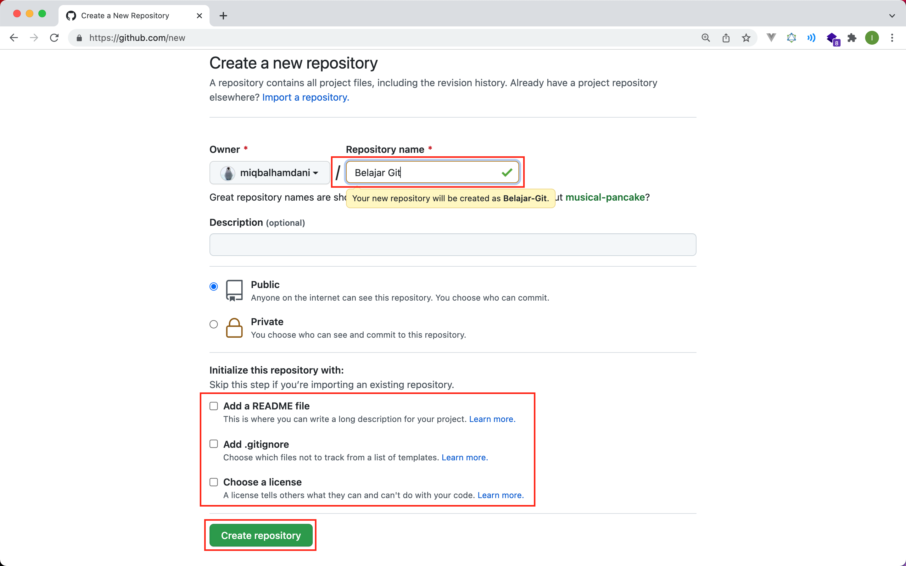
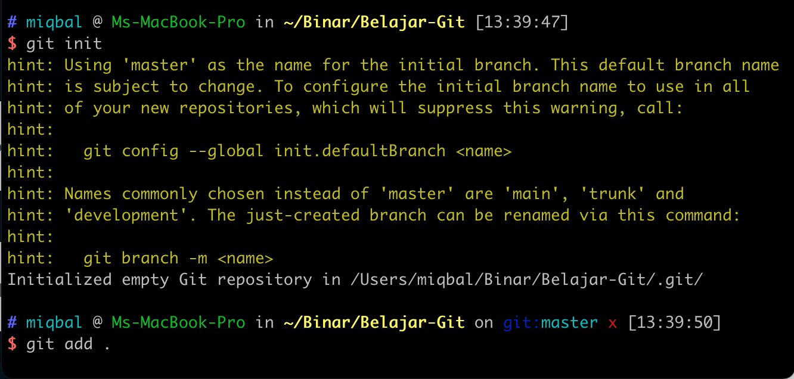
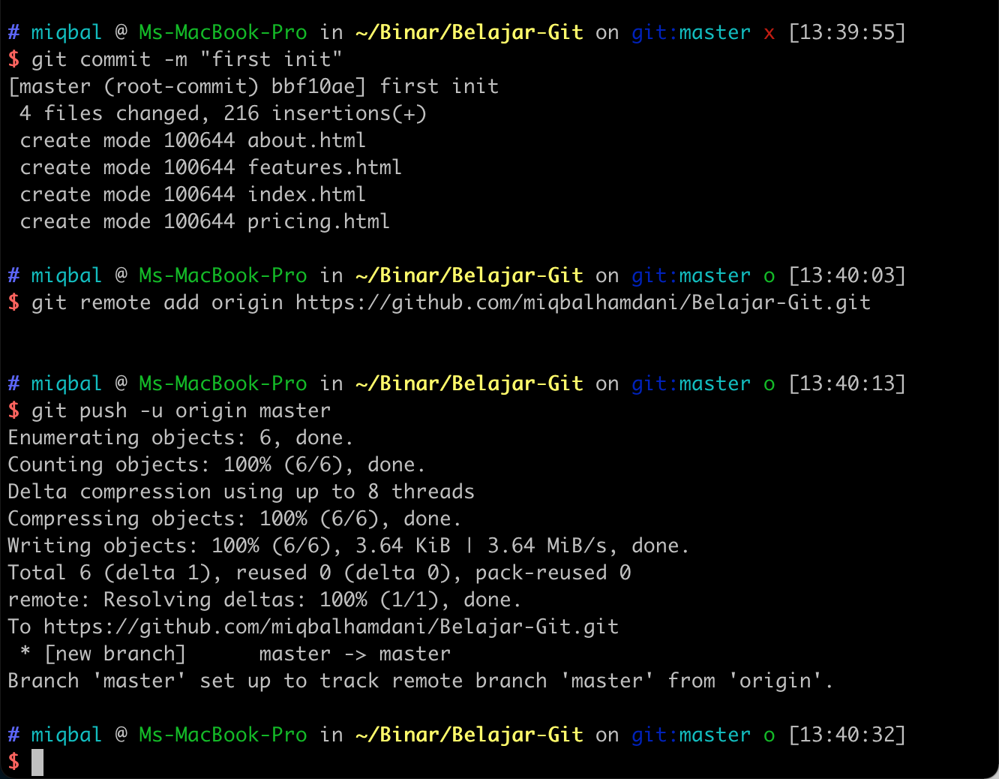
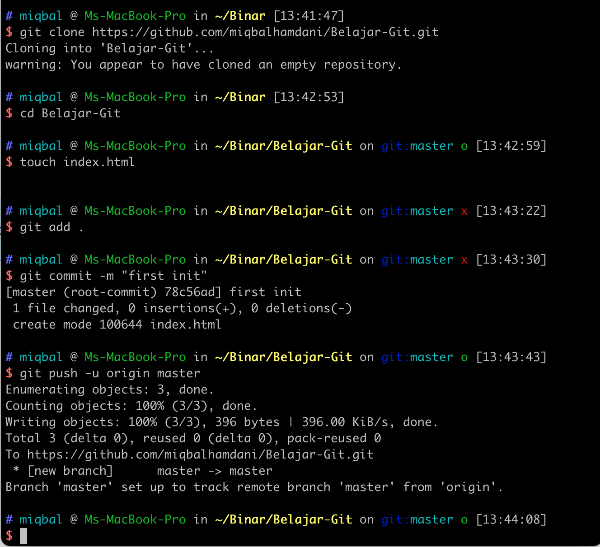

### 1. Login Akun Github

Apabila sudah memiliki akun github bisa login [disini https://github.com/login](https://github.com/login), atau apabila belum bisa register telebih dahulu [disini https://github.com/signup?source=login](https://github.com/signup?source=login).


### 2. Create New Repository

Klik tombol **New** pada menu **Repositories** untuk membuat repository baru. Atau bisa klik [disini https://github.com/new](https://github.com/new).



- Masukan **Repository Name**
- Jenis Repository bisa pilih **Public** atau **Private**
- untuk **Add a README file**, **Add .gitignore**, dan **Choose a license** tidak usah di checklist.
- Lalu bisa klik **Create Repository**

### 3. Setting Username dan Email di terminal

```bash
// setting username secara global
$ git config --global user.name "Username Anda"

// setting email secara global
$ git config --global user.email IsiDenganEmailAnda@gmail.com


// untuk melihat username apakah sudah terset
$ git config user.name

// untuk melihat email apakah sudah terset
$ git config user.email
```

<br />

## Push An Existing Repository

untuk yang sudah ada folder / project yang sudah siap untuk diupload.

1. Inisialisasi Git

```bash
$ git init
```

2. Pastikan file yang akan kita **Upload** / akan kita masukan **Remote Repository** di `commit` terbelih dahulu.

```bash
// untuk memindahkan semua file dari working directory ke staging area
$ git add .

// commit file yang sudah berada di staging area
$ git commit -m "first init"
```

3. Mengkoneksikan **local repository** dan **remote repository**.

```bash
$ git remote add origin https://github.com/miqbalhamdani/Belajar-Git.git
```

4. Push / Upload file ke **remote repository**

```bash
$ git push -u origin master
```

5. Check di website github, apakah file kita sudah terupload.





<br />
<br />

## Create a new repository

untuk yang belum memiliki project atau belum membuat folder untuk project.

1. Clone atau copy project dari **remote repository** ke komputer kita.

```bash
$ git clone https://github.com/miqbalhamdani/Belajar-Git.git
```

2. Masuk ke folder yang telah kita clone

```bash
$ cd Belajar-Git
```

3. Tambahkan beberapa file. Bisa **create new file** di Visual Studio Code. Atau menggunakan terminal seperti di bawah ini.

```bash
$ touch index.html
```

4. Pilih file yang akan kita **Upload** / akan kita masukan **Remote Repository**, lalu kita `commit`.

```bash
// Pindahkan semua file dari working directory ke staging area
$ git add .

// commit file yang sudah berada di staging area
$ git commit -m "first init"
```

5. Push / Upload file ke **remote repository**

```bash
$ git push -u origin master
```

6. Check di website github, apakah file kita sudah terupload.





source: <br />
https://www.niagahoster.co.id/blog/git-tutorial-dasar/
