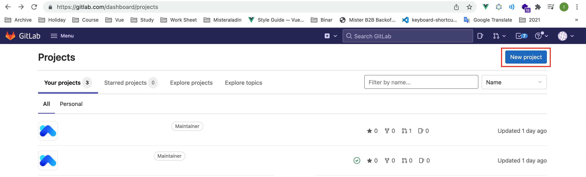
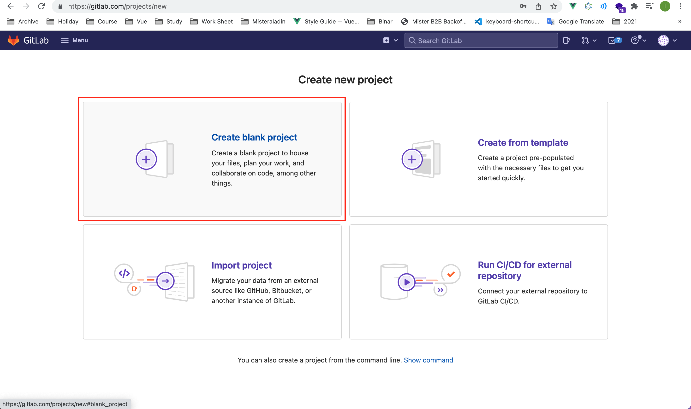
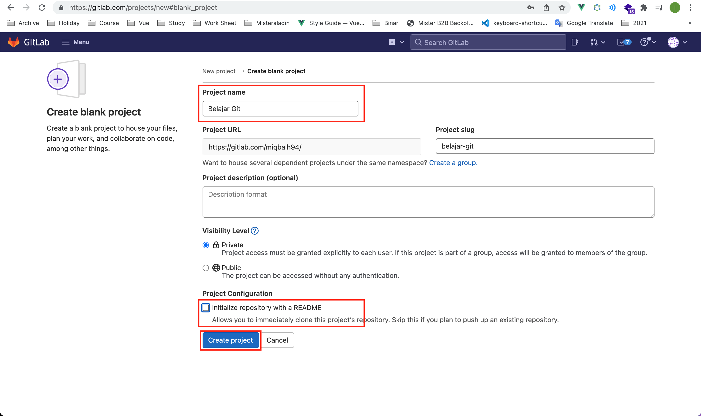
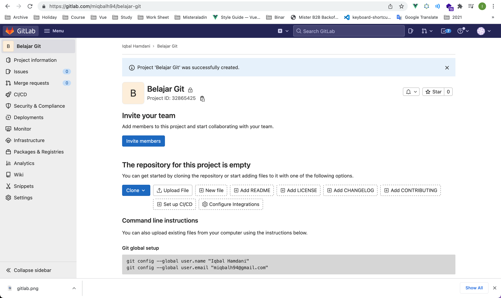
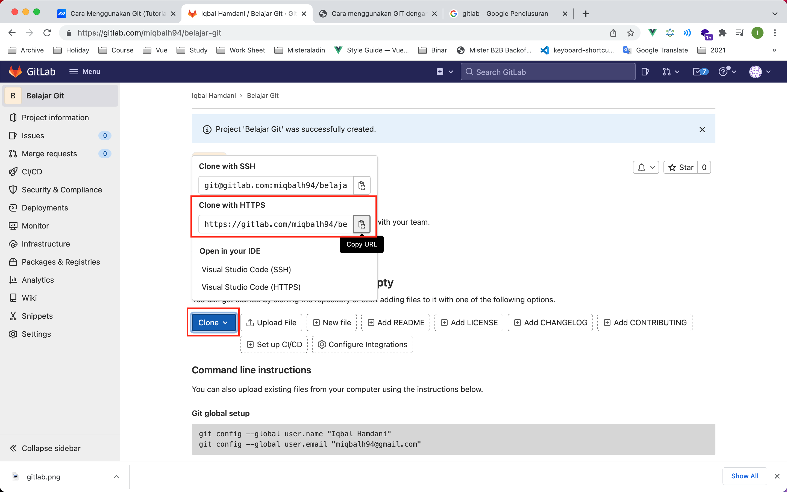
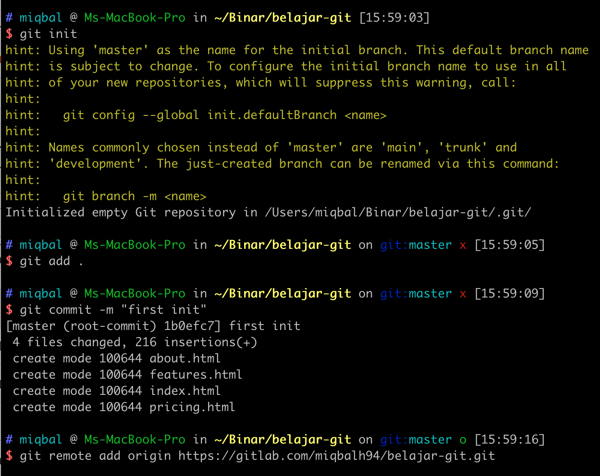
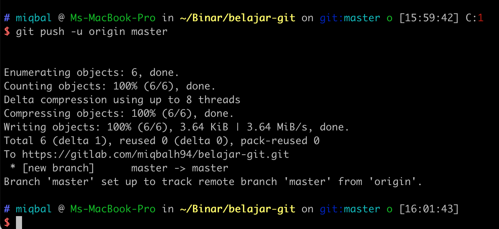
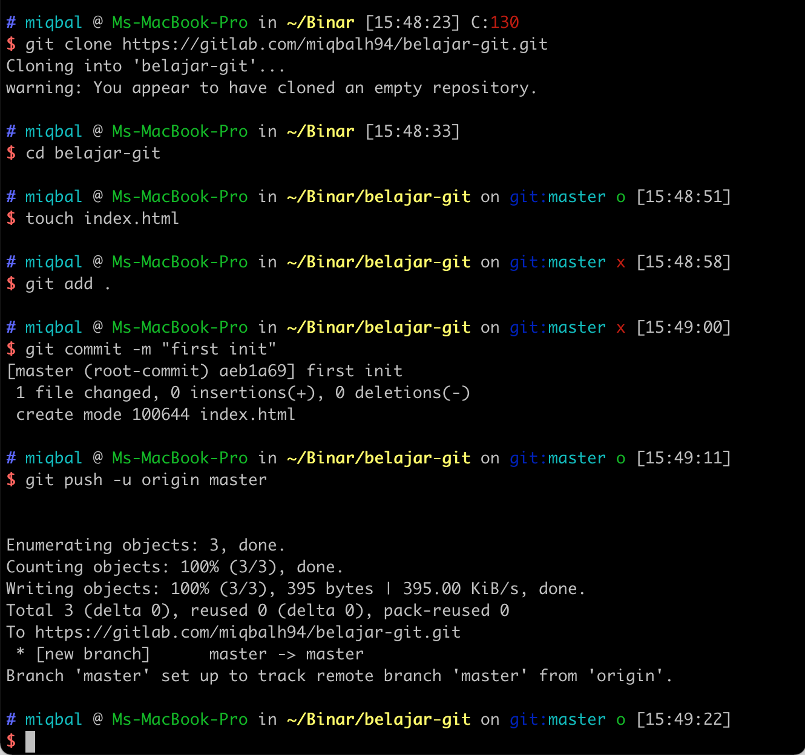

### 1. Login Akun Gitlab

Apabila sudah memiliki akun gitlab bisa login [disini https://gitlab.com/users/sign_in](https://gitlab.com/users/sign_in), atau apabila belum bisa register telebih dahulu [disini https://gitlab.com/users/sign_up](https://gitlab.com/users/sign_up).


### 2. Create New Repository

Klik tombol **New Project** untuk membuat repository baru. Atau bisa klik [disini https://gitlab.com/projects/new](https://gitlab.com/projects/new).




### 3. Piliah Create Blank Project



### 4. Isi Form lalu, Create Project



- Masukan **Project Name**
- Untuk Visibility Level bisa pilih **Public** atau **Private**
- untuk **Project Configuration**, jangan lupa uncheck **Initialize repository with a README**.
- Lalu bisa klik **Create Project**



<br />

### 5. Setting Username dan Email di terminal

Kembali ke terminal, lalu setting username dan email.

```bash
// setting username secara global
$ git config --global user.name "Username Anda"

// setting email secara global
$ git config --global user.email IsiDenganEmailAnda@gmail.com


// untuk melihat username apakah sudah terset
$ git config user.name

// untuk melihat email apakah sudah terset
$ git config user.email
```

<br />

## Push An Existing Repository

Opsi ini dilakukan apabila kita sudah memiliki project yang sudah siap untuk di upload ke **Remote Repository**.

1. Inisialisasi Git

```bash
$ git init
```

2. Pastikan file yang akan kita **Upload** / akan kita masukan **Remote Repository** di `commit` terbelih dahulu.

```bash
// untuk memindahkan semua file dari working directory ke staging area
$ git add .

// commit file yang sudah berada di staging area
$ git commit -m "first init"
```

3. Mengkoneksikan **local repository** dan **remote repository**.

```bash
$ git remote add origin git@gitlab.com:miqbalh94/belajar-git.git
```



Untuk url remote, bisa di copy disini.
  - Pilih tombol **Clone**.
  - Copy url dari **Clone with HTTPS**

<br />

4. Push / Upload file ke **remote repository**

```bash
$ git push -u origin master
```

5. Check di website gitlab, apakah file kita sudah terupload.





<br />
<br />

## Create a new repository

Opsi ini dilakukan, apabila kita belum mempunyai project sama sekali, dan baru ingin membuat project tersebut.

1. Clone atau copy project dari **remote repository** ke komputer kita.

```bash
$ git clone https://gitlab.com/miqbalh94/belajar-git.git
```


Untuk url clone, bisa di copy disini.
  - Pilih tombol **Clone**.
  - Copy url dari **Clone with HTTPS**

<br />

2. Masuk ke folder yang telah kita clone

```bash
$ cd belajar-git
```

3. Tambahkan beberapa file. Bisa **create new file** di Visual Studio Code. Atau menggunakan terminal seperti di bawah ini.

```bash
$ touch index.html
```

4. Pilih file yang akan kita **Upload** / akan kita masukan **Remote Repository**, lalu kita `commit`.

```bash
// Pindahkan semua file dari working directory ke staging area
$ git add .

// commit file yang sudah berada di staging area
$ git commit -m "first init"
```

5. Push / Upload file ke **remote repository**

```bash
$ git push -u origin master
```

6. Check di website gitlab, apakah file kita sudah terupload.



