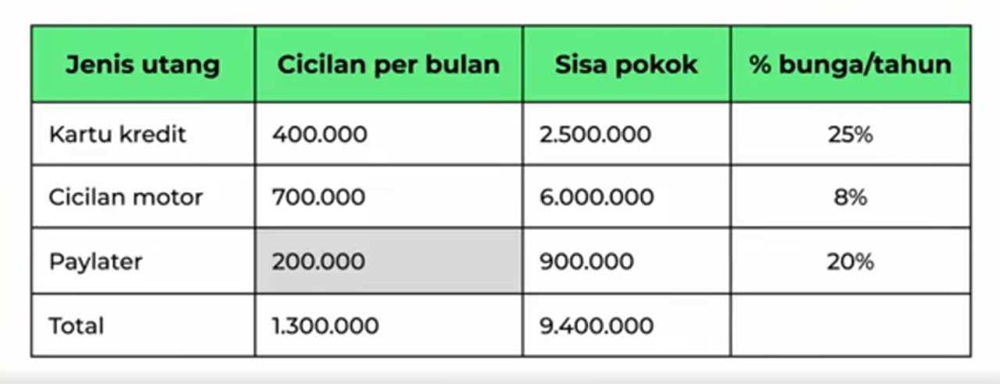

Banyak dari kita belum bisa menyisihkan incomenya untuk ditabung dan berinvestasi karena hutangnya yang masih menumpuk. Kalau kondisinya seperti itu **Fokus dulu untuk melunasi Hutang**, baru setelah itu persiapkan **Dana Darurat**, **Asuransi**, dan **Investasi**.  

Personal Finance Series:
1. [Financial Check Up](/financial-check-up/)
2. [Budgeting](/budgeting/)
3. **[Melunasi Hutang]()**

 

## Cara Melunasi Hutang Secara Cepat
---
Hutang dibagi 2:

**1. Hutang Produktif**  
Meminjam untuk kegiatan yang menghasilkan uang lagi.
- Kredit usaha
- Kredit modal kerja
- Cicilan laptop untuk kerja/usaha
- KPR untuk kos-kosan

**2. Hutang Konsumtif**  
Meminjam untuk kegiatan yang **tidak** menghasilkan uang lagi.
- Kartu Kredit
- Cicilah HP
- Kredit Kendaraan Motor
- KPR untuk rumah tinggal

> Kita akan coba fokus melunasi hutang - hutang konsumtif selain KPR.

 
 

## Studi Case
---
Misalkan Arnold punya beberapa hutang, dengan total cicilan 1,3Jt perbulan. Padalah penghasilannya hanya 3Jt perbulan, yang berarti Arnold dalam kondisi keuangan yang tidak sehat, pada **Ratio Cicilan**.

1. Jangan ambil hutang baru, untuk menutupi hutang lama.
2. Bikin budget yang jelas dan praktekan.  
Untuk bulan - bulan pertama Arnold harus hidup sehamat hemat nya dan fokus lunasi hutang.    
Alokasikan 40%-50% atau sekitar 1,5Jt untuk fokus bayar cicilan, 5%-10% ditabung untuk **Dana Daurat**, dan sisanya untuk hidup. Tidak perlu asuransin dan berinvestasi terlebih dahulu.    
3. Perlahan lunasi hutang dengan ***Dept Snowball Method*** // ***Dept Avalance Method***.
4. Kemuian kalau uangnya tidak cukup untuk kebutuhan hidup dan bayar hutang, cari uang tambahan dengan side job, dan menjual, atau menyewakan, atau mengadaikan aset yang kita punya sekarang.

 
 

## 2 Cara untuk melunasi hutang
---
***1. Dept Snowball Method***
Fokus melunasi hutang dengan cicilan terkecil. Jadi budget 1.5Jt untuk bayar cicilan,dialokasikan untuk semua cicilan sesuai dengan batas minimum, dan bayar berlebih untuk **Paylater**.

**Keunggulan:** Kita menjadi lebih puas, dan termotivasi, karena cicilan kecil itu lebih cepat untuk dilunasi.

 

***2. Dept Avalance Method***
Fokus lunasi hutang dengan presentase bunga terbesar. Kalau dibuku hutang Alnold kartu kredit merupakan salah satu dengan bunga tertinggi dengan 25% pertahun. Jadi budget 1,5Jt untuk bayar cicilan dialokasikan untuk semua cicilan sesuai batas minimum, dan bayar berlebih untuk yang Kartu Kredit.

**Keunggulan:** Kita membayar bunga yang lebih rendah.

 

> Kedua cara tersebut bisa digunakan sama baiknya, sesuaikan dengan karakter masing-masing.

 
 

Sumber:  
https://www.ternakuang.id/academy/18359/
