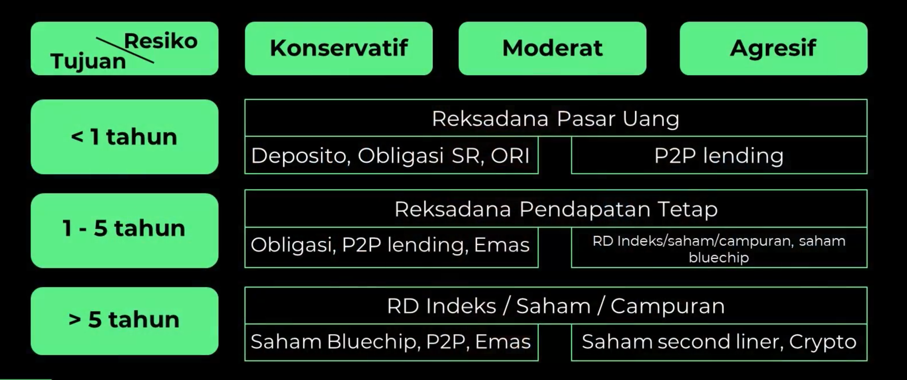

Untuk mencapai suatu tujuan, kita perlu tau, kita itu sekarang ada dimana ? uang yang kita butuhkan itu berapa? jadi kita tau kurang nya itu berapa?

## Set Goals
1. Tentukan budget
2. Kapan mau beli
3. Uang yang dimiliki saat ini

 

## Simulasi Beli Rumah
- Misalkan harga properti saat ini **500Jt**
- Kita pengin beli rumah **5Thn** lagi
- Anggap uang yang dimiliki sekarang **10Jt**
- Anggap **DP 50%** (Angka 50%-60% adalah angka yang ideal agar cicilan tidak lama dan tidak besar nilainya)
- Asumsi inflasi properti pertahun **5%**

> Sehingga uang yang diperlukan 5 tahun lagi untuk DP sekitar **319Jt**

 

### Berapa uang yang harus kita tabung setiap bulan supaya mimpi kita tercapai ?
Salah satu caranya adalah **Investasi**

- Misalkan Income kita **10Jt**
- Uang yang disisihkan untuk menabung 20%-30% sekitar **2Jt setiap bulan**
- Perkiraan return investasi adalah **10% pertahun**

> Hasilnya **5 tahun** lagi sekitar **172Jt**, dan ini tidak cocok dengan budget yang diperlukan yaitu **319Jt**.

 

### Terus bagaimana solusinya ?
Jadi kita harus menyesuaikan beberapa hal, agar mimpinya tercapai. Beberapa strategi yang bisa dilakukan:

1. Panjangkan waktu mimpi kita
2. Turunkan budget beli rumbah // turunkan DP
3. Cari Income tambahan

- Misalkan kita rubah waktu nya, dari **5Thn** menjadi **7Thn*
- Setelah itu kita berhemat dan cari Income tambahan, sehingga setiap kita bisa menabung **3Jt setiap bulannya**

> Hasilnya setelah **7Thn**, DP untuk properti kita menjadi **351Jt** dan uang hasil Investasi kita menjadi **385Jt**.

## [Link Excel Menghitung Mimpi](https://bit.ly/3yrFZHu)
---
 

## Investasi apa yang cocok untuk dana membeli rumah?
Cara nya bisa dibagi 2, 50% taruh di **Reksadana** dan 50% lagi di taruh di produk investasi lain yang return nya lebih tinggi disesuikan dengan profil resiko masing-masing.

 

## Sewa vs Beli
Ada 2 variabel untuk menentukan kamu cocoknya beli atau sewa:

1. Cicilan (biaya yang harus kita bayar setiap bulannya)
Misalkan penghasilan **10Jt**, pertahun cicilan untuk rumah **4Jt** perbulan sekitar 40% dari penghasilan, dan itu sudah lebih dari batas ideal yaitu tidak lebih dari 30% penghasilan.

2. Harga Rumah // (Jika dibandingan penghasilan kita setiap tahun)
Yaitu harga rumah dibandingan dengan 5x income tahunan kita. Misalkan income tahunan *100jt* dikali 5 menjadi *500jt*, sedangkan harga rumah yang mau kita beli adalah 500jt.

> Jadi harga rumah yang mau kita beli adalah sama dengan 5x income tahunan, artinya kita boleh beli rumah tersebut.

Tetapi apabila rumah yang mau kita beli adalah **800Jt**, yarng berarti harga rumah tersebut lebih dari 5x income tahunan, **Jadi lebih baik sewa**.

 

## Cash vs KPR

| Cash | KPR |   |
|------|-----|---|
| Punya budget besar // tabungan yang cukup | Untuk budget yang terbatas // tabungan untuk beli rumah nya masih kurangnya // masih punya kebutuhan lain yang urgent. |   |
| Punya penghasilan yang jauh lebih besar dari pada kebutuhan sehari-hari. |   |   |

Untuk yang mengerti dan paham tentang **Investasi** mungkin akan lebih prefer **KPR** karena bisa mamaksimalkan **Cash** untuk **Investasi** atau **Bisnis**.
Misalkan apabila 50% atau setengah uang ini bisa kita kelola di instrumen investasi yang returnnya **12%**, sedangkan bunga KPR yang harus dibayar mungkin sekitar **8%-10%**, berarti kita masih dapat keuntungan sekitar **2%-4%**, karena kita tidak membayar secara Cash.

 

## Hal yang Perlu Diperhatikan saat Beli Rumah

1. Lokasi dan akses infrastruktur
2. Cek fasilitas umum di setikar (rumah sakit, pasar, sekolah)
3. Perhatikan developer properti
4. Harga properti dibandingan kemampuan membeli kita

 
 
 

Sumber:  
https://www.ternakuang.id/academy/156856/
